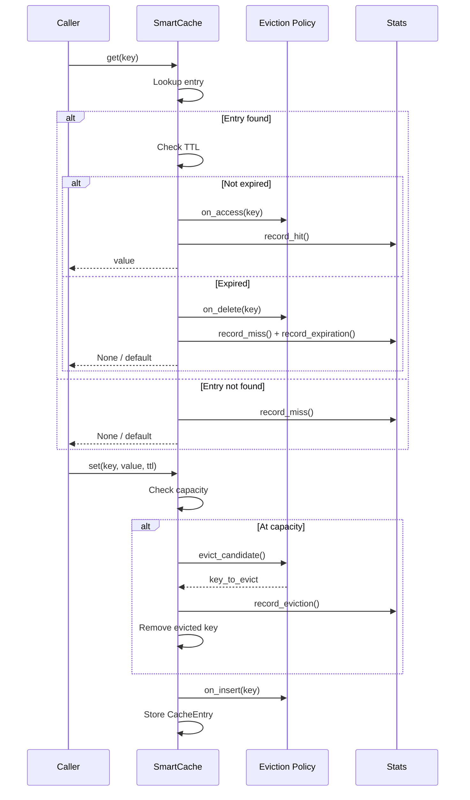
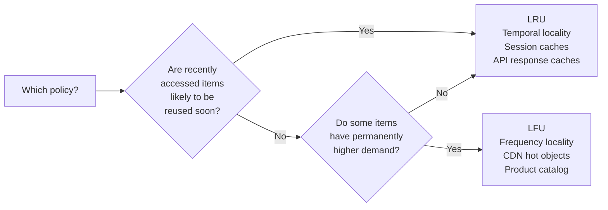

# smartcache

**Intelligent in-memory caching for Python — LRU/LFU eviction, TTL, thread-safety, decorator API.**


---

## Why smartcache?

Most Python caching libraries are either too simple (`functools.lru_cache` has no TTL) or too heavy (Redis, Memcached). `smartcache` sits in the middle: production-grade in-process caching with the features you actually need, zero external dependencies.

---

## Architecture

```mermaid
flowchart TD
    A[Client Code] -->|set / get / del| B[SmartCache]

    B --> C{Eviction Policy}
    C -->|policy='lru'| D[LRUPolicy\nOrderedDict O-1]
    C -->|policy='lfu'| E[LFUPolicy\nFrequency Buckets O-1]

    B --> F[CacheEntry Store\ndict of CacheEntry]
    F --> G{TTL Check\non access}
    G -->|valid| H[Return value]
    G -->|expired| I[Remove + return None]

    B --> J[StatsCollector\nhits / misses / evictions]
    B --> K[Background Sweep Thread\nauto_expire_interval]

    L[@cached decorator] --> B
    M[@cached_method decorator] --> B
```

---

## Eviction Policies

### LRU (Least Recently Used)

Evicts the item that has not been accessed for the longest time.

```
Access order (most recent → least recent):
  [E] → [C] → [A] → [D] → [B]
                             ↑
                        evict this next (LRU)
```

**Best for:** Workloads with temporal locality — if you accessed something recently, you'll likely need it again.

---

### LFU (Least Frequently Used)

Evicts the item accessed the fewest times. Ties are broken by recency.

```
Frequency table:
  key_A: ████████ 8 accesses
  key_B: ████     4 accesses
  key_C: █        1 access   ← evict this next
```

**Best for:** CDN-style workloads where popular items should stay cached regardless of recency.

---

## Request Lifecycle



---

## Installation

```bash
pip install smartcache
# Zero runtime dependencies — stdlib only
```

---

## Quick Start

```python
from smartcache import SmartCache, cached, cached_method

# ── Direct cache usage ──────────────────────────────────────────────────────
cache = SmartCache(capacity=1024, policy='lru', default_ttl=300)

cache.set('user:42', {'name': 'Primel'})
user = cache.get('user:42')

# Dict-like interface
cache['session:abc'] = 'data'
print('session:abc' in cache)  # True
del cache['session:abc']

# Cache-aside pattern
user = cache.get_or_set(
    'user:99',
    factory=lambda: db.fetch_user(99),
    ttl=120
)

# ── Decorator API ───────────────────────────────────────────────────────────
@cached(ttl=60, capacity=512)
def get_weather(city: str) -> dict:
    return api.fetch(city)  # Only called on cache miss

# Inspect and manage
get_weather.cache_stats()    # CacheStats(hit_rate='87.3%', ...)
get_weather.cache_clear()    # Flush all cached results
get_weather.cache_delete('Calgary')  # Invalidate one key

# ── Method-level caching ────────────────────────────────────────────────────
class UserService:
    @cached_method(ttl=120)
    def get_profile(self, user_id: int) -> dict:
        return self._db.fetch(user_id)   # per-instance cache
```

---

## API Reference

### `SmartCache(capacity, policy, default_ttl, auto_expire_interval)`

| Parameter | Type | Default | Description |
|-----------|------|---------|-------------|
| `capacity` | `int` | `256` | Max entries before eviction |
| `policy` | `'lru' \| 'lfu'` | `'lru'` | Eviction algorithm |
| `default_ttl` | `float \| None` | `None` | Default TTL in seconds |
| `auto_expire_interval` | `float \| None` | `None` | Background sweep frequency (s) |

### Methods

| Method | Description |
|--------|-------------|
| `set(key, value, ttl=...)` | Insert or update an entry |
| `get(key, default=None)` | Retrieve a value (lazy expiry) |
| `delete(key) → bool` | Remove a key |
| `contains(key) → bool` | Check existence with TTL check |
| `get_or_set(key, factory, ttl=...)` | Cache-aside pattern, thread-safe |
| `expire_all() → int` | Manual sweep of all expired entries |
| `stats() → CacheStats` | Point-in-time metrics snapshot |
| `clear()` | Remove all entries, reset stats |
| `shutdown()` | Stop background sweep thread |

---

## Statistics

```python
s = cache.stats()

s.hit_rate       # 0.873 (float)
s.hit_rate_pct   # '87.3%' (string)
s.hits           # 1420
s.misses         # 207
s.evictions      # 14
s.expirations    # 83
s.utilization    # 0.61 (fraction of capacity in use)
```

---

## LRU vs LFU: When to Choose



---

## Thread Safety

All public methods acquire a reentrant lock (`threading.RLock`). The `get_or_set` method uses double-checked locking to prevent cache stampedes under concurrent load — the factory function is called at most once per key even with hundreds of simultaneous requests.

---

## License

Apache 2.0 — Copyright 2026 [Primel Jayawardana](https://primelj.dev)
